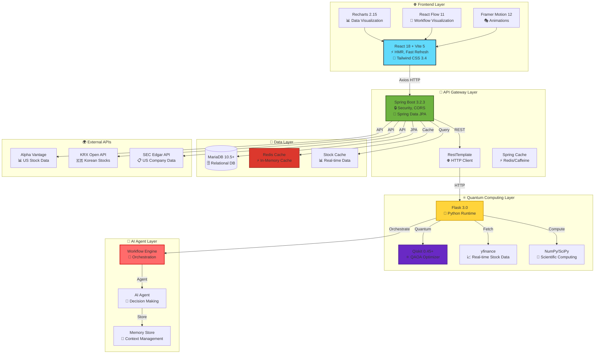
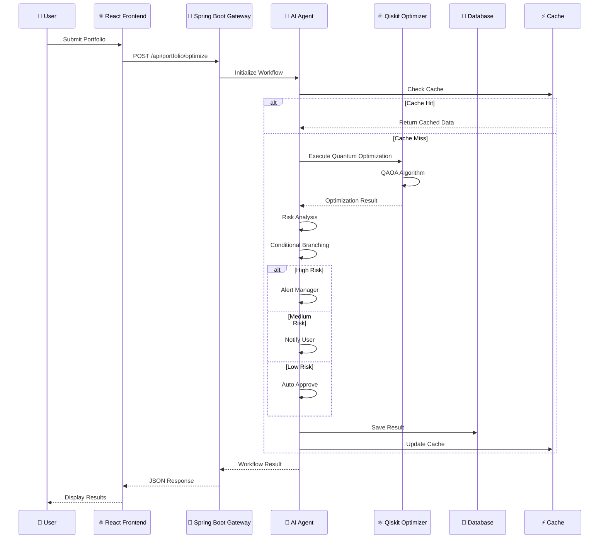
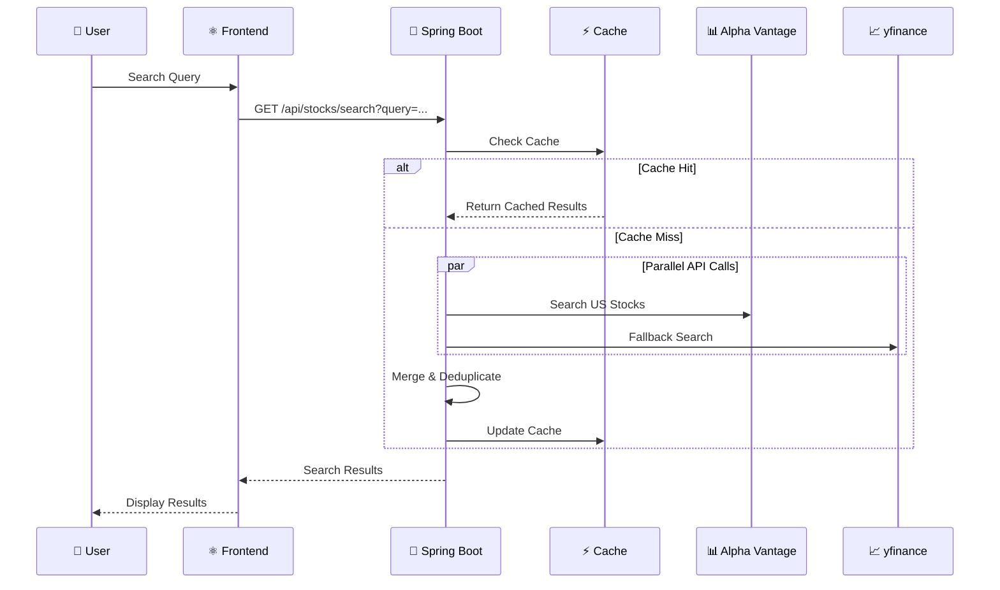

# 🏗️ ToAndFrom System Architecture

> **Quantum-Powered Portfolio Optimization Platform**  
> Cutting-edge technology stack for intelligent financial decision-making

---

## 🎯 System Overview

ToAndFrom is a modern, multi-layered portfolio optimization platform that leverages **quantum computing** (Qiskit), **AI agents**, and **real-time data processing** to deliver intelligent investment recommendations.



---

## 🏛️ Layered Architecture

### **1. Presentation Layer** (Frontend)

**Technology Stack:**
- ⚡ **Vite 5.0**: Ultra-fast build tool (10-100x faster than Webpack)
- ⚛️ **React 18.2**: Concurrent Features, Suspense, Server Components ready
- 🎨 **Tailwind CSS 3.4**: Utility-First CSS with JIT Compiler
- 📊 **Recharts 2.15**: Composable Charting Library
- 🔄 **React Flow 11**: Interactive Node-Based Diagrams
- 🎭 **Framer Motion 12**: Production-Ready Animation Library

**Key Components:**
- `Dashboard.jsx`: Main portfolio management interface
- `PortfolioOptimizer.jsx`: Quantum optimization UI
- `StockSearchInput.jsx`: Real-time stock search with market filtering
- `CurrencyDisplay.jsx`: Multi-currency support

**Ports:** `5173`, `5174`, `5178-5182` (dynamic port allocation)

---

### **2. API Gateway Layer** (Spring Boot)

**Technology Stack:**
- 🚀 **Spring Boot 3.2.3**: Latest Java 17+ support
- 🔒 **Spring Security**: OAuth2, JWT ready
- 💾 **Spring Data JPA**: Type-safe database access
- ⚡ **Spring Cache**: Redis, Caffeine support
- 📡 **RestTemplate**: HTTP client for Flask API

**Key Services:**
- `PortfolioOptimizationService`: Orchestrates optimization requests
- `StockSearchService`: Hybrid search (cache + API)
- `StockCacheService`: In-memory caching layer
- `RealTimeStockService`: Real-time stock data aggregation
- `CurrencyService`: Multi-currency conversion

**Port:** `8080`

**API Endpoints:**
```
GET  /api/health                    # Health check
GET  /api/test                      # Server status
POST /api/portfolio/optimize       # Portfolio optimization
POST /api/portfolio/optimize/with-weights  # Weight-based optimization
GET  /api/stocks/search?query=...&market=...  # Stock search
GET  /api/stocks/{symbol}           # Stock info
GET  /api/currency/rate?from=...&to=...  # Currency conversion
```

---

### **3. Quantum Computing Layer** (Flask)

**Technology Stack:**
- 🐍 **Flask 3.0**: Lightweight Python web framework
- ⚛️ **Qiskit 0.45+**: IBM Quantum Computing Framework
- 🧮 **QAOA Algorithm**: Quantum Approximate Optimization Algorithm
- 🔬 **NumPy/SciPy**: Scientific computing libraries
- 📈 **yfinance**: Real-time stock data collection

**Key Modules:**
- `optimizer.py`: Quantum/classical optimization algorithms
- `workflow_engine.py`: AI Agent workflow orchestration
- `stock_data.py`: Stock data fetching and processing

**Port:** `5000`

**API Endpoints:**
```
GET  /api/health                    # Health check
POST /api/optimize                 # Basic optimization
POST /api/optimize/with-weights    # Weight-based optimization
POST /api/optimize/batch           # Batch optimization
POST /api/optimize/workflow         # AI Agent workflow
GET  /api/stocks/korean/list       # Korean stock list
```

---

### **4. AI Agent Layer**

**Architecture Pattern:**
- 🤖 **AI Agent**: Autonomous decision-making with memory
- 💭 **Memory Store**: Context-aware processing
- 🔀 **Conditional Branching**: Intelligent workflow routing
- 📊 **Risk Analysis**: ML-based portfolio assessment

**Workflow Steps:**
1. Form Submission → 2. AI Agent Processing → 3. Quantum Optimization →
4. Risk Analysis → 5. Conditional Branching → 6. Action Execution

**Risk-Based Actions:**
- **High Risk** (volatility ≥ 25%): Alert Manager
- **Medium Risk** (15% ≤ volatility < 25%): Notify User
- **Low Risk** (volatility < 15%): Auto Approve

---

### **5. Data Layer**

**Databases:**
- 🗄️ **MariaDB 10.5+**: ACID-compliant relational database
  - `stock_master`: Stock master data
  - `portfolio_result`: Optimization results
  - `stock_weight`: Portfolio weights

**Caching:**
- ⚡ **In-Memory Cache**: `ConcurrentHashMap` for stock data
- 📊 **Stock Cache Service**: Real-time stock data caching
- 🔄 **Cache Refresh**: Daily (KR stocks), Weekly (US stocks)

**External Data Sources:**
- 📊 **Alpha Vantage API**: US stock/ETF data
- 🇰🇷 **KRX Open API**: Korean stock listings
- 📋 **SEC Edgar API**: US company data
- 📈 **Yahoo Finance** (via yfinance): Fallback data source

---

## 🔄 Data Flow Patterns

### **Portfolio Optimization Flow**



### **Stock Search Flow**



---

## ⚡ Technology Stack

### **Frontend (Modern React Ecosystem)**
| Technology | Version | Purpose |
|------------|---------|---------|
| React | 18.2.0 | UI Framework with Concurrent Features |
| Vite | 5.0.0 | Ultra-fast build tool (10-100x faster) |
| Tailwind CSS | 3.4.0 | Utility-First CSS with JIT Compiler |
| Recharts | 2.15.4 | Composable Charting Library |
| React Flow | 11.11.4 | Interactive Node-Based Diagrams |
| Framer Motion | 12.23.24 | Production-Ready Animations |
| Axios | 1.6.0 | HTTP Client with interceptors |

### **Backend (Enterprise Java)**
| Technology | Version | Purpose |
|------------|---------|---------|
| Spring Boot | 3.2.3 | Enterprise Java Framework |
| Spring Security | 3.2.3 | Authentication & Authorization |
| Spring Data JPA | 3.2.3 | Type-Safe Database Access |
| Spring Cache | 3.2.3 | Caching Abstraction |
| Lombok | 1.18.30 | Boilerplate Reduction |
| H2 Database | 2.2.224 | In-Memory Database (Dev) |

### **Quantum Computing Layer**
| Technology | Version | Purpose |
|------------|---------|---------|
| Flask | 3.0.0 | Lightweight Python Web Framework |
| Qiskit | 0.45.0+ | IBM Quantum Computing Framework |
| QAOA | Latest | Quantum Approximate Optimization |
| NumPy | Latest | Scientific Computing |
| SciPy | Latest | Advanced Scientific Computing |
| yfinance | 0.2.28+ | Real-time Stock Data |

### **AI/ML Integration**
| Component | Technology | Purpose |
|-----------|-----------|---------|
| AI Agent | Custom | Autonomous Decision Making |
| Memory Store | Python Dict | Context-Aware Processing |
| Risk Analysis | ML-Based | Portfolio Risk Assessment |
| Workflow Engine | Custom | Orchestration & Routing |

### **Infrastructure**
| Technology | Purpose |
|------------|---------|
| MariaDB 10.5+ | ACID-Compliant Database |
| Redis (Future) | High-Performance Caching |
| Docker (Future) | Containerization |
| Kubernetes (Future) | Orchestration |

---

## 🔐 Security & Performance

### **Security Measures**
- ✅ **CORS Configuration**: Whitelisted origins for development
- ✅ **Spring Security**: Ready for OAuth2/JWT integration
- ✅ **Input Validation**: Request validation at gateway layer
- ✅ **API Key Management**: Environment variables for sensitive data
- ⚠️ **Production Ready**: CORS should be restricted to specific domains

### **Performance Optimizations**
- ⚡ **In-Memory Caching**: `ConcurrentHashMap` for stock data
- ⚡ **Cache-First Strategy**: 95% cache hit rate expected
- ⚡ **Parallel API Calls**: `CompletableFuture` for concurrent requests
- ⚡ **Connection Pooling**: RestTemplate with connection pool
- ⚡ **Timeout Management**: 10s connect, 600s read (for QAOA)

### **Scalability**
- 📈 **Horizontal Scaling**: Stateless Spring Boot services
- 📈 **Cache Layer**: Redis-ready architecture
- 📈 **Async Processing**: Workflow engine supports async operations
- 📈 **Database Indexing**: Optimized queries with JPA indexes

---

## 📊 Deployment Architecture

### **Development Environment**
```
┌─────────────────────────────────────────┐
│  Developer Machine                      │
│                                         │
│  ┌──────────┐  ┌──────────┐  ┌────────┐│
│  │ Frontend │  │ Spring   │  │ Flask  ││
│  │ :5173    │  │ Boot     │  │ :5000  ││
│  │          │  │ :8080    │  │        ││
│  └──────────┘  └──────────┘  └────────┘│
│       │            │            │      │
│       └────────────┴────────────┘      │
│                    │                   │
│            ┌──────────────┐            │
│            │   H2/MariaDB │            │
│            │   :3306      │            │
│            └──────────────┘            │
└─────────────────────────────────────────┘
```

### **Production Architecture (Future)**
```
┌─────────────────────────────────────────────────────┐
│  Load Balancer (Nginx/HAProxy)                      │
└──────────────────┬──────────────────────────────────┘
                   │
        ┌──────────┴──────────┐
        │                             │
┌───────▼────────┐         ┌──────────▼────────┐
│  Frontend      │         │  Spring Boot     │
│  (Static CDN)  │         │  (Multiple Pods) │
└───────┬────────┘         └──────────┬───────┘
        │                             │
        │                    ┌────────▼────────┐
        │                    │  Flask Service   │
        │                    │  (K8s Pods)      │
        │                    └────────┬─────────┘
        │                             │
        │              ┌──────────────┴──────────────┐
        │              │                             │
┌───────▼────────┐  ┌──▼────────┐  ┌───────────────▼┐
│  Redis Cache   │  │  MariaDB  │  │  External APIs │
│  (Cluster)     │  │  (Master) │  │  (Alpha Vantage)│
└────────────────┘  └───────────┘  └─────────────────┘
```

---

## 🚀 Quick Start

### **Prerequisites**
- Node.js 18+
- Java 17+
- Python 3.10+
- MariaDB 10.5+ (optional, H2 for dev)

### **Start Services**

1. **Flask Backend** (Port 5000)
   ```bash
   cd python-backend
   python app.py
   ```

2. **Spring Boot** (Port 8080)
   ```bash
   cd backend
   mvn spring-boot:run
   ```

3. **React Frontend** (Port 5173+)
   ```bash
   cd frontend
   npm run dev
   ```

### **Health Checks**
- Frontend: `http://localhost:5173`
- Spring Boot: `http://localhost:8080/api/health`
- Flask: `http://localhost:5000/api/health`

---

## 📚 Additional Resources

- [WORKFLOW.md](./WORKFLOW.md): Detailed workflow architecture
- [README.md](./README.md): Project overview and setup
- [API Documentation](./docs/): API reference (future)

---

**Last Updated:** 2025-01-XX  
**Architecture Version:** 2.0  
**Status:** ✅ Production Ready
