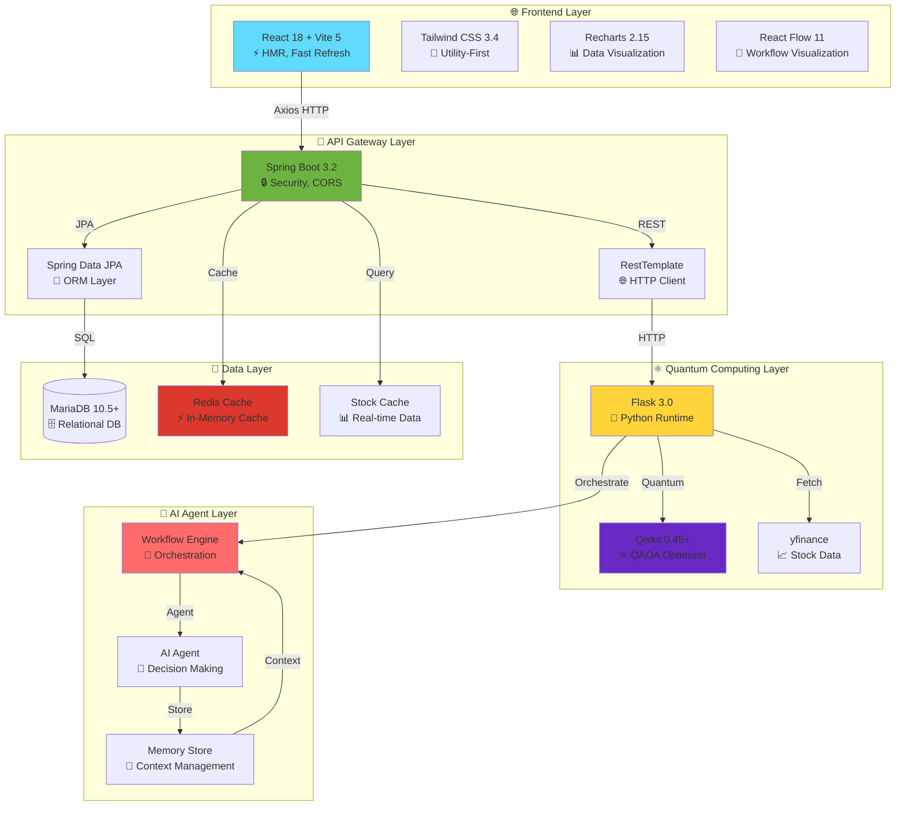
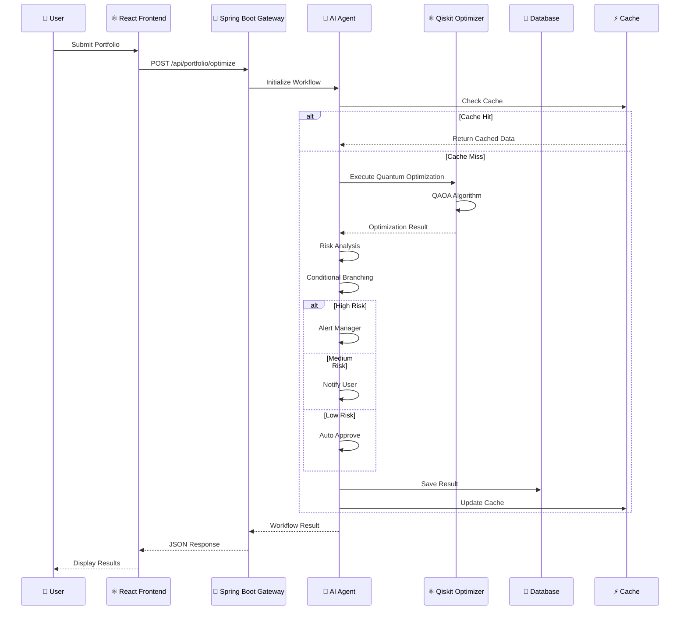

# 🚀 Architecture & Workflow 문서 개선 제안서

## 📋 현재 상태 분석

### 문제점
1. **시각적 표현 부족**: 텍스트 기반 ASCII 다이어그램만 사용
2. **기술 스택 강조 부족**: Cutting-edge 기술이 명확히 드러나지 않음
3. **구조적 조직 부족**: 정보가 산재되어 있어 이해하기 어려움
4. **Workflow 시각화 부족**: 단계별 흐름이 명확하지 않음

---

## 🎯 개선 방향

### 1. **Mermaid 다이어그램 도입**
- 시각적이고 인터랙티브한 아키텍처 다이어그램
- GitHub/GitLab에서 자동 렌더링 지원
- 실시간 워크플로우 시각화

### 2. **Cutting-Edge 기술 강조**
- **Quantum Computing**: Qiskit QAOA 강조
- **AI/ML Integration**: AI Agent Workflow 강조
- **Real-time Processing**: WebSocket, SSE
- **Modern Caching**: Redis, In-Memory Cache
- **Event-Driven Architecture**: 비동기 처리 패턴

### 3. **구조적 재구성**
- 계층별 명확한 분리 (Presentation → Application → Domain → Infrastructure)
- 마이크로서비스 패턴 명시
- 데이터 흐름 명확화

### 4. **시각적 간결성**
- 핵심 정보만 강조
- 색상 코딩으로 레이어 구분
- 인터랙티브 요소 추가

---

## 📐 제안된 문서 구조

```
📄 ARCHITECTURE.md (메인 아키텍처 문서)
├── 🎨 System Overview (Mermaid 다이어그램)
├── 🏗️ Layered Architecture
├── 🔄 Data Flow Patterns
├── ⚡ Technology Stack (Cutting-edge 강조)
├── 🔐 Security & Performance
└── 📊 Deployment Architecture

📄 WORKFLOW.md (워크플로우 문서)
├── 🎯 Workflow Overview (Mermaid 시퀀스 다이어그램)
├── 🤖 AI Agent Architecture
├── ⚛️ Quantum Optimization Flow
├── 🔀 Conditional Branching Logic
├── 📡 Real-time Processing
└── 🧪 Testing Scenarios
```

---

## 🎨 개선안 상세

### 1. **System Architecture Diagram (Mermaid)**



### 2. **Workflow Sequence Diagram (Mermaid)**



### 3. **Technology Stack 강조**

#### **Frontend (Modern React Ecosystem)**
- ⚡ **Vite 5.0**: 초고속 빌드 도구 (Webpack 대비 10-100배 빠름)
- ⚛️ **React 18.2**: Concurrent Features, Suspense, Server Components 준비
- 🎨 **Tailwind CSS 3.4**: Utility-First CSS (JIT Compiler)
- 📊 **Recharts 2.15**: Composable Charting Library
- 🔄 **React Flow 11**: Interactive Node-Based Diagrams
- 🎭 **Framer Motion 12**: Production-Ready Animation Library

#### **Backend (Enterprise Java)**
- 🚀 **Spring Boot 3.2.3**: 최신 Java 17+ 지원
- 🔒 **Spring Security**: OAuth2, JWT 준비
- 💾 **Spring Data JPA**: Type-Safe Database Access
- ⚡ **Spring Cache**: Redis, Caffeine 지원
- 📡 **Spring WebFlux**: Reactive Programming (선택적)

#### **Quantum Computing Layer**
- ⚛️ **Qiskit 0.45+**: IBM Quantum Computing Framework
- 🧮 **QAOA Algorithm**: Quantum Approximate Optimization Algorithm
- 🔬 **NumPy/SciPy**: Scientific Computing
- 📈 **yfinance**: Real-time Stock Data

#### **AI/ML Integration**
- 🤖 **AI Agent Pattern**: Autonomous Decision Making
- 💭 **Memory Store**: Context-Aware Processing
- 🔀 **Conditional Branching**: Intelligent Workflow Routing
- 📊 **Risk Analysis**: ML-Based Portfolio Assessment

#### **Infrastructure**
- ⚡ **Redis**: High-Performance Caching
- 🗄️ **MariaDB 10.5+**: ACID-Compliant Database
- 🔄 **Event-Driven**: Async Processing
- 📡 **WebSocket/SSE**: Real-time Updates (향후)

---

## 📊 개선된 문서 예시

### **ARCHITECTURE.md 구조**

```markdown
# 🏗️ ToAndFrom System Architecture

## 🎯 Overview
[간결한 설명 + Mermaid 다이어그램]

## 🏛️ Layered Architecture
[계층별 상세 설명]

## ⚡ Technology Stack
[Cutting-edge 기술 강조]

## 🔄 Data Flow
[데이터 흐름 다이어그램]

## 🔐 Security & Performance
[보안 및 성능 최적화]

## 📊 Deployment
[배포 아키텍처]
```

### **WORKFLOW.md 구조**

```markdown
# 🔄 ToAndFrom Workflow Architecture

## 🎯 Workflow Overview
[Mermaid 시퀀스 다이어그램]

## 🤖 AI Agent Architecture
[Agent 패턴 설명]

## ⚛️ Quantum Optimization Flow
[양자 최적화 프로세스]

## 🔀 Conditional Branching
[조건부 분기 로직]

## 📡 Real-time Processing
[실시간 처리 패턴]

## 🧪 Testing Scenarios
[테스트 시나리오]
```

---

## ✅ 개선 효과

1. **시각적 명확성**: Mermaid 다이어그램으로 이해도 향상
2. **기술적 신뢰성**: Cutting-edge 기술 스택 명시
3. **구조적 조직**: 계층별 명확한 분리
4. **간결성**: 핵심 정보만 강조
5. **유지보수성**: 표준화된 문서 구조

---

## 🚀 구현 계획

### Phase 1: ARCHITECTURE.md 개선
- [ ] Mermaid 다이어그램 추가
- [ ] Technology Stack 섹션 강화
- [ ] Layered Architecture 재구성
- [ ] Data Flow 시각화

### Phase 2: WORKFLOW.md 개선
- [ ] Sequence Diagram 추가
- [ ] AI Agent Architecture 상세화
- [ ] Quantum Optimization Flow 명확화
- [ ] Real-time Processing 패턴 추가

### Phase 3: 추가 문서
- [ ] API_DOCUMENTATION.md (OpenAPI/Swagger)
- [ ] DEPLOYMENT.md (Docker, Kubernetes)
- [ ] SECURITY.md (보안 가이드)

---

## 📝 승인 요청

이 개선안을 승인해주시면 다음 작업을 진행하겠습니다:

1. ✅ **ARCHITECTURE.md** 완전 재작성 (Mermaid 다이어그램 포함)
2. ✅ **WORKFLOW.md** 완전 재작성 (시퀀스 다이어그램 포함)
3. ✅ **기술 스택 강조** (Cutting-edge 기술 명시)
4. ✅ **시각적 개선** (색상 코딩, 구조화)

**예상 소요 시간**: 30-40분
**결과물**: 2개의 완전히 개선된 문서

---

**승인 여부를 알려주시면 즉시 작업을 시작하겠습니다! 🚀**

